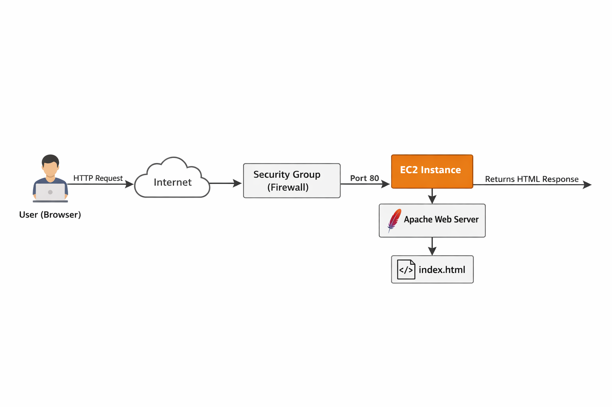

# AWS EC2 Web Server Deployment 🚀

This project demonstrates deploying a web server on AWS using EC2 and Apache, simulating a real-world cloud infrastructure setup.

---

## 📌 Overview

In this project, I built and deployed a web server from scratch using AWS services and Linux administration.

### Key Actions:
- Launched an EC2 instance (Amazon Linux)
- Configured security groups (SSH & HTTP access)
- Connected to the instance via SSH
- Installed and configured Apache (httpd)
- Deployed a custom HTML webpage

---

## 🧱 Architecture Diagram

---

## 🛠️ Technologies Used

- AWS EC2
- Linux (Amazon Linux / Ubuntu)
- Apache (httpd)
- SSH
- Git & GitHub

---

## 📂 Project Walkthrough

Instead of cluttering this page with screenshots, each phase of the project is organized below:

### 🔹 Day 1 – Setup & Configuration
- EC2 setup
- Security groups
- SSH connection
- Architecture diagram

👉 View details: [Day 1 Folder](./day-1)

---

### 🔹 Day 2 – Web Server Deployment
- Apache installation
- Website deployment
- HTML/CSS customization
- UI improvements

👉 View details: [Day 2 Folder](./day-2)

---

## 📈 What I’m Learning

- Provisioning and configuring cloud infrastructure
- Managing security groups and network access
- Remote server access using SSH
- Installing and managing web servers (Apache)
- Structuring and documenting projects using Git

---

## 🚀 Next Steps

- Adding CSS styling to improve UI/UX
- Introducing JavaScript for interactivity
- Containerizing the application using Docker
- Expanding into scalable cloud architecture

---

## 💡 Project Goal

This project is part of my journey transitioning from IT Support into Cloud and DevOps, focusing on building real, hands-on infrastructure experience.

---

## 👤 Author

NessTechDev
Cloud & IT Support | AWS | DevOps (In Progress)

GitHub: https://github.com/NessTechDev
LinkedIn: https://linkedin.com/in/goodness-ejionye-86315b248
X (Twitter): https://x.com/nesstechdev
