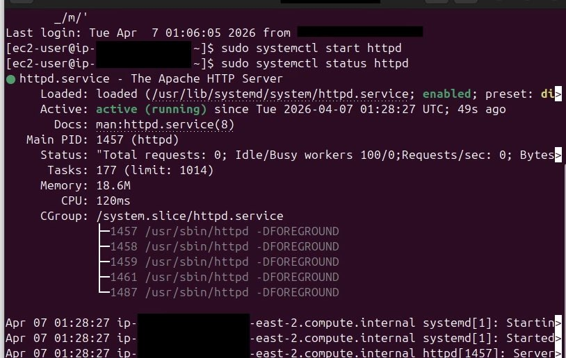
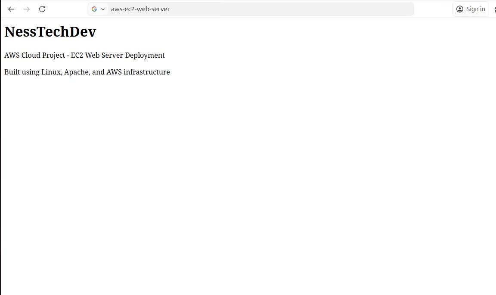

# AWS EC2 Web Server Project

This project demonstrates deploying a basic web server using using AWS EC2 and Apache

---

## Architecture Diagram

## 📌  Project Overview
- Launched EC2 instance (Amazon Linux 2023)
- Connected via SSH using key pair authentication
- Installed and configured Apache (httpd)
- Configured security groups (SSH & HTTP)
- Hosted a live website

---

## 🛠️  Tech Used
- AWS EC2
- Linux (Amazon Linux 2023)
- Apache (httpd)
- Networking (Security Groups)
- SSH
- Git & GitHub

---
## 📸  Project Screenshots

### SSH Connection

### Live Web Page

## Result
A publicly accessible web server running on AWS

---

## 📈  What I Learned

- How to launch and configure EC2 instances
- Basics of cloud networking and security groups
- Connecting to remote servers using SSH
- Deploying a web server with Apache
- Managing and documenting projects with Git

---

## 🚀 Next Steps

- Add CSS styling to improve UI/UX
- Introduce JavaScript for interactivity
- Containerize application using Docker
- Expand into scalable cloud architecture

---

## 💡 Project Goal

This project is part of my journey transitioning from IT Support into Cloud and DevOps, focusing on building real, hands-on infrastructure experience.

---

## 👤 Author

NessTechDev
Cloud & IT Support | AWS | DevOps (In Progress)

GitHub: https://github.com/NessTechDev
LinkedIn: https://linkedin.com/in/goodness-ejionye-86315b248
X (Twitter): https://x.com/nesstechdev
