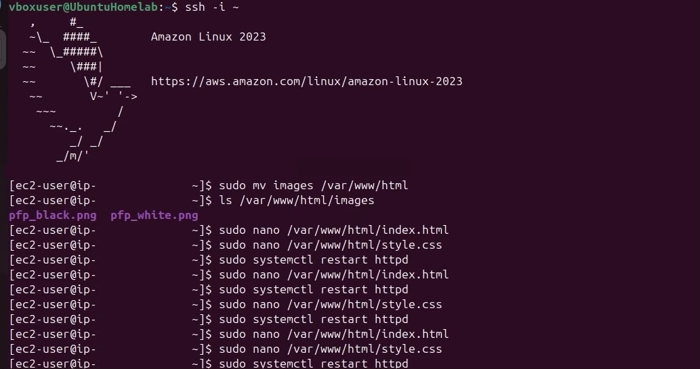
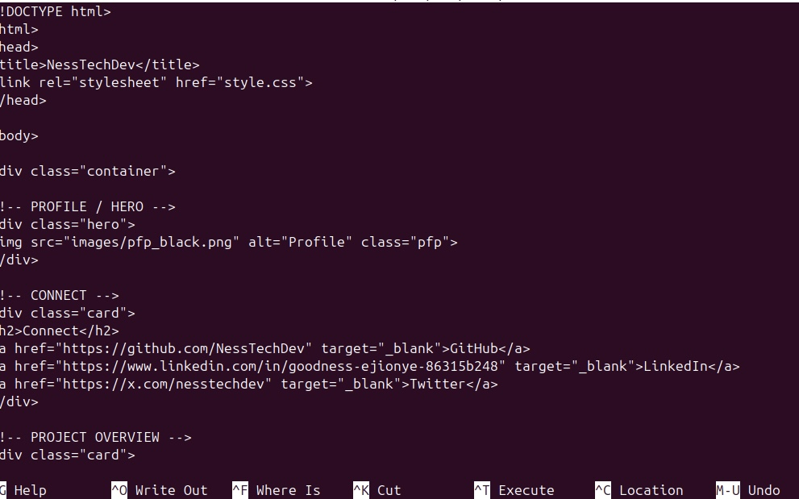
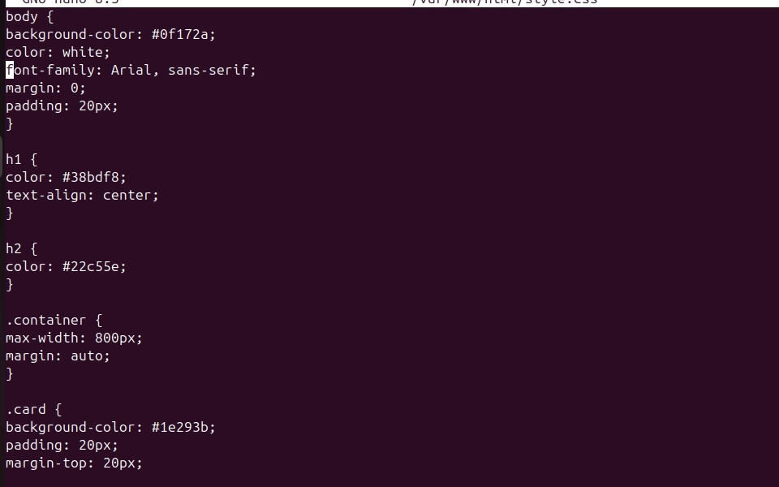
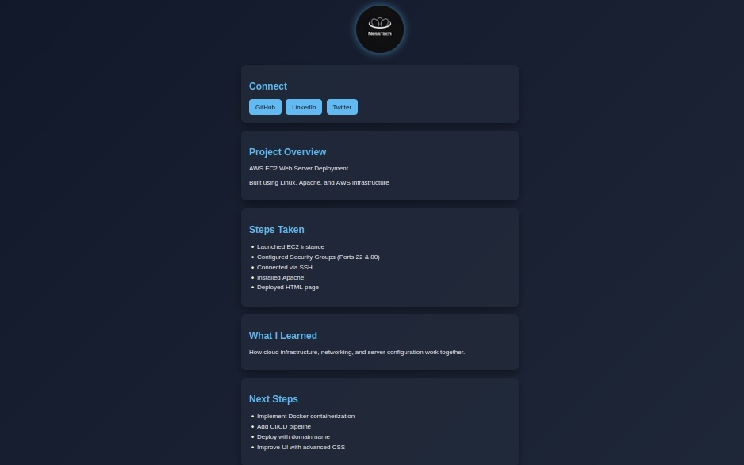

# Day 2 – Web Page Styling & UI Enhancement 🎨

---

## 📌 Overview

On Day 2, I focused on improving the visual appearance of the web server by adding custom HTML structure and CSS styling.

---

## 🛠️ What I Did

- Created structured HTML layout
- Added CSS styling for layout and colors
- Organized content into sections (cards)
- Added profile image (PFP)
- Improved UI/UX design

---

## 📸 Screenshots

### 🖥️ Apache & File Setup

### 🧱 HTML Structure

### 🎨 CSS Styling

### 🌐 Final Web Page

---

## 📈 What I’m Learning

- How front-end structure connects to backend servers
- Styling web pages using CSS
- Organizing UI components for better user experience
- Deploying updates to a live server

---

## 🚀 Next Steps

- Improving UI with more advanced CSS
- Adding animations and transitions
- Introducing JavaScript for interactivity
- Preparing for containerization (Docker)

---
