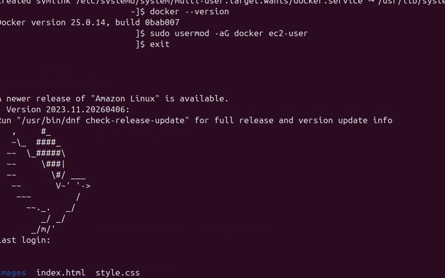
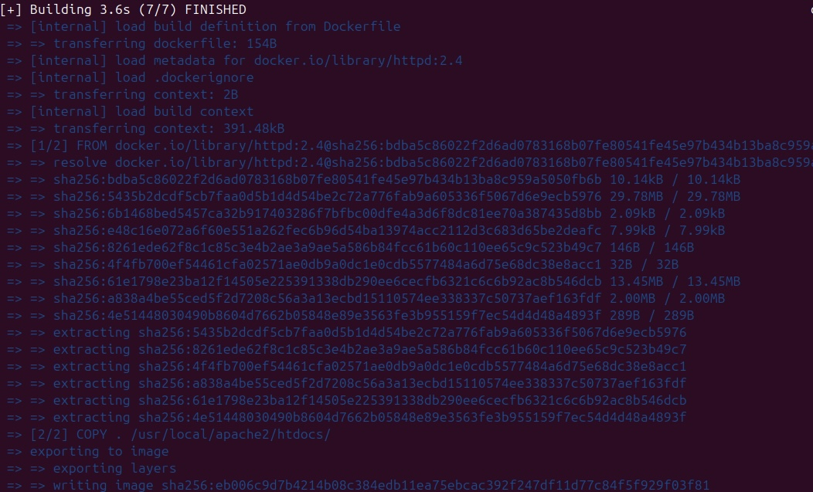
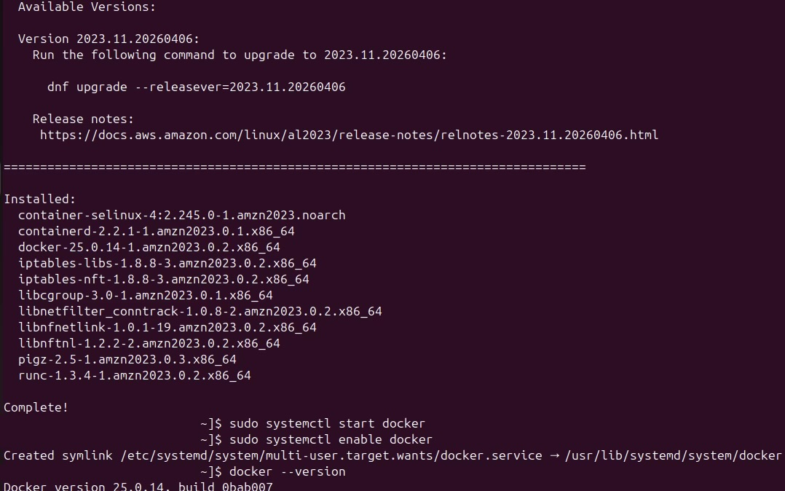
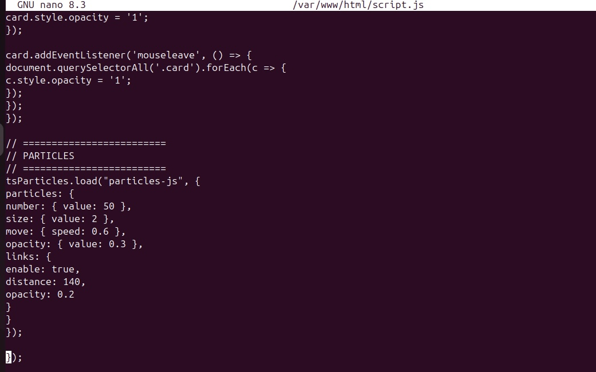
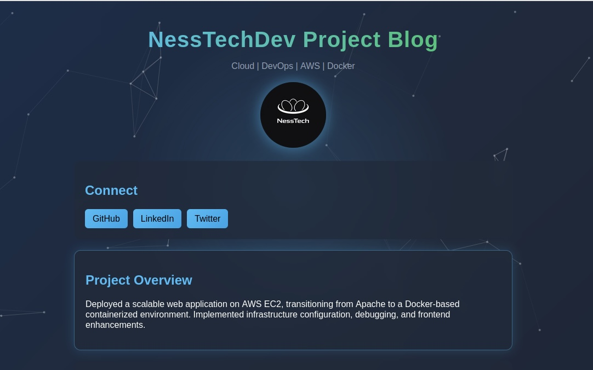

# 🚀 Day 3 — Docker Containerization & UI Enhancements

## 📌 Overview
On Day 3, I transitioned my web application from a traditional Apache deployment to a Docker-based containerized environment on AWS EC2.

In addition, I enhanced the frontend with animations, improved styling, and interactive UI elements to make the project more polished and engaging.

---

## 🧠 What I Learned

- How to install and configure Docker on a Linux server
- How to create a Dockerfile using an Apache base image
- How to build Docker images and run containers
- How to troubleshoot real-world issues:
- Permission errors
- Port conflicts (Apache vs Docker)
- Service failures
- How containerization differs from traditional deployments
- How to enhance UI using CSS + JavaScript animations

---

## ⚙️ Key Actions

- Installed Docker on EC2 instance
- Enabled and started Docker service
- Created a Dockerfile using httpd:2.4

Built Docker image:
docker build -t my-web-app .

Ran container:
docker run -d -p 80:80 my-web-app

- Stopped Apache to resolve port conflicts
- Debugged container execution issues
- Added Anime.js for animations
- Implemented hover effects and UI improvements

---

## 🐳 Dockerfile

FROM httpd:2.4
COPY . /usr/local/apache2/htdocs/

---

## 🖥️ Architecture

User → Browser → EC2 Instance → Docker Container → Apache → Website

---

## 📸 Screenshots

### 🔧 Docker Installation

### 🐳 Docker Build

### ✅ Docker Verification

### 🎨 Frontend JavaScript Enhancements

### 🌐 Final UI Design

---

## 🎥 Demo (UI Animation)

---

## 🧪 Challenges Faced

- yum command not found → switched to correct package manager
- Permission issues when editing Dockerfile
- Apache running on port 80 blocking Docker
- Docker image not found due to naming mismatch
- Website not updating due to caching / container issues

---

## 🔜 Next Steps

- Break project into Day-based navigation pages
- Implement CI/CD pipeline (GitHub → EC2)
- Deploy using a custom domain
- Continue improving UI/UX
- Add more interactivity with JavaScript

---

## 📂 Project Structure

day-3/
│── index.html
│── style.css
│── script.js
│── Dockerfile
│── screenshots/

---

## 🏁 Summary

Day 3 marked a major milestone by introducing Docker containerization and elevating the project with modern UI enhancements.

This step brought the project closer to a real-world DevOps + frontend integrated workflow.
